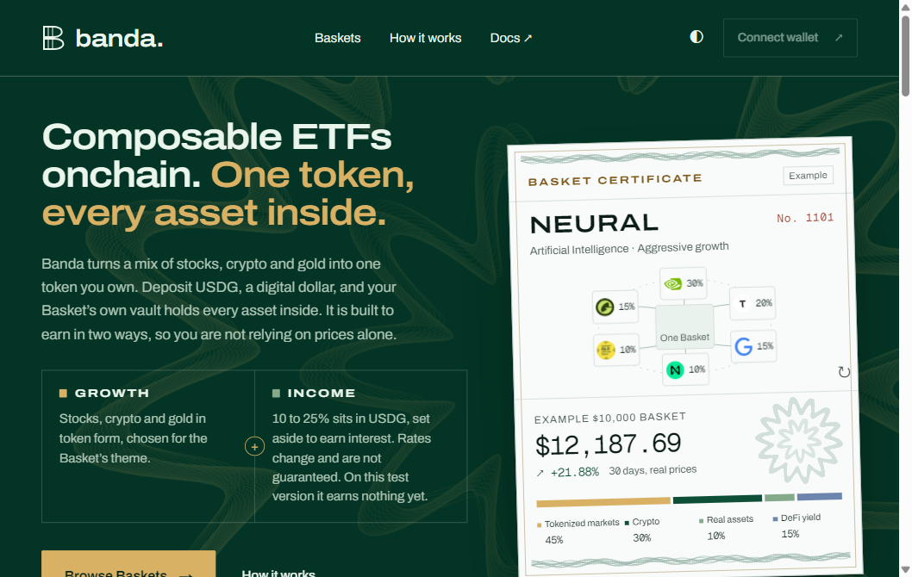
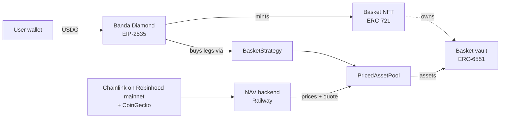

# Banda

> **Composable ETFs onchain. One token, every asset inside.**

Banda is a composable ETF platform on Robinhood Chain. Deposit USDG and you receive a Basket: one ERC-721 token with its own ERC-6551 vault that holds every stock, crypto and gold position inside. Send the token and the whole portfolio moves with it. Each holding can be checked onchain, in the Basket's own vault.

**[Try it on testnet](https://www.bandafinance.xyz)** · [Diamond on the explorer](https://explorer.testnet.chain.robinhood.com/address/0xB1dD20D06fc0741237c812Ca904bD8dc3f7DE4e7) · [How it works](https://www.bandafinance.xyz/docs)



## Key features

- **One token, a whole portfolio:** a Basket is an ERC-721 token. Its ERC-6551 vault holds the assets, and only the Diamond can operate that vault, through a short allow-list of actions.
- **0% in, 0% out, 0.25% a year:** no fee to buy or withdraw. The yearly fee is charged only on withdrawal.
- **Live market prices:** Chainlink feeds on Robinhood Chain mainnet, converted through USDG/USD with a 0.99–1.01 peg band, plus CoinGecko for SOL, TAO, NEAR and RENDER. The pool rejects prices older than 15 minutes and moves of more than 20% in one update.
- **Settled in Paxos USDG:** deposits and withdrawals use Paxos' official testnet USDG.
- **Built to compose:** Baskets are standard tokens, so other protocols can hold, lend or trade them. Banda curates the five demo Baskets today; open creation is on the roadmap.

## Built during Open House

- **Diamond core (EIP-2535):** facets for deposit, holdings-aware redeem, Basket NFT, views, admin, NAV guard and rebalance, all on one namespaced storage layout.
- **Vault-held assets:** every leg is bought straight into the Basket's vault, and a withdrawal sells exactly the vault's share.
- **Market-priced pool:** `PricedAssetPool` with an updater, a freshness check, a per-update bound and owner override, fed by Chainlink on Robinhood Chain mainnet.
- **On-demand NAV backend:** a Bun service on Railway. When a signed-in user starts a buy or withdrawal, it publishes fresh prices and a quote. It verifies Privy JWTs, accepts only the app's exact origin, writes to a persistent journal and is capped at 120 updates a day.
- **Settlement migrations:** `SettlementMigrationInit` switches the settlement asset and refuses to run while any Basket is open. Every live migration was rehearsed on a fork of live state first.
- **App:** Privy sign-in by email, Google or wallet; buy, partial and full withdrawal; P&L per Basket; backtests on real closing prices; a storage-based indexer that needs no database.
- **Robinhood Chain integration:** all contracts are deployed on Robinhood Chain testnet (chain 46630), and prices are read from Chainlink on Robinhood Chain mainnet (chain 4663).
- **Tests:** 191 automated tests (115 Foundry + 76 Node), plus type checking and a production build, in one `bun run check`.

## Architecture



Withdrawal runs the same path in reverse: the vault's share of each leg is sold back to USDG and paid to the NFT owner, after a fresh quote (at most 900 seconds and 20 parent blocks old).

## Contract addresses

Robinhood Chain testnet, chain ID 46630.

| Contract | Address |
| --- | --- |
| Banda Diamond | [`0xB1dD20D06fc0741237c812Ca904bD8dc3f7DE4e7`](https://explorer.testnet.chain.robinhood.com/address/0xB1dD20D06fc0741237c812Ca904bD8dc3f7DE4e7) |
| Paxos USDG (settlement) | [`0x7E955252E15c84f5768B83c41a71F9eba181802F`](https://explorer.testnet.chain.robinhood.com/address/0x7E955252E15c84f5768B83c41a71F9eba181802F) |
| PricedAssetPool | [`0x938dc51789b1023f7ab7a63d420aa10351af2681`](https://explorer.testnet.chain.robinhood.com/address/0x938dc51789b1023f7ab7a63d420aa10351af2681) |
| NEURAL strategy (21) | [`0x164bdec855268f04a978b1dfefae35f13f155a41`](https://explorer.testnet.chain.robinhood.com/address/0x164bdec855268f04a978b1dfefae35f13f155a41) |
| RAILS strategy (22) | [`0xcb2f3f3d2c48830a41b576f24d03dc50644cbabc`](https://explorer.testnet.chain.robinhood.com/address/0xcb2f3f3d2c48830a41b576f24d03dc50644cbabc) |
| RESERVE strategy (23) | [`0x1aa8339caa51c0391aa7a4cd5f09c77c8a0ba1d4`](https://explorer.testnet.chain.robinhood.com/address/0x1aa8339caa51c0391aa7a4cd5f09c77c8a0ba1d4) |
| FRONTIER strategy (24) | [`0xb6ff097c240271401866b34543e077c02c390948`](https://explorer.testnet.chain.robinhood.com/address/0xb6ff097c240271401866b34543e077c02c390948) |
| FORTRESS strategy (25) | [`0xad019bdf40b46a130ffc8f93ade62329aa7040e7`](https://explorer.testnet.chain.robinhood.com/address/0xad019bdf40b46a130ffc8f93ade62329aa7040e7) |

## Testnet honesty

- Vault holdings are clearly labelled practice tokens, minted and burned by the pool and bought and sold at live market prices. They are not the real assets.
- The income portion (10–25% of each Basket) holds USDG and earns nothing on testnet. On mainnet it is designed to sit in a USDG yield vault; see [YIELD_ADMISSION.md](contracts/YIELD_ADMISSION.md).
- History charts are hypothetical backtests on real closing prices, not a record of trades.
- Admin is a single key on testnet. A multisig and timelock come before mainnet.

## Quick start

Prerequisites: [Bun](https://bun.sh), Node.js 22+ and [Foundry](https://getfoundry.sh).

```sh
git clone https://github.com/immanueljanis/banda.git
cd banda
bun install
cp .env.example .env.local   # Privy app id and RPC URLs
bun run dev
```

To try a deposit, get testnet USDG from the [Paxos faucet](https://faucet.paxos.com/?network=robinhood) and testnet ETH for gas from the Robinhood Chain faucet.

Run every check (Node tests, Foundry tests, `tsc`, `next build`):

```sh
bun run check
```

Contracts only:

```sh
forge test --root contracts --match-contract Banda
```

## Repository layout

- `contracts/src/diamond/`: EIP-2535 proxy, cut, loupe and ownership
- `contracts/src/banda/`: facets, the Basket vault, strategy, pools and the settlement initializer
- `contracts/script/`: deployment and migration scripts for Robinhood Chain testnet
- `app/`, `components/`: the Next.js app
- `lib/chain/`: chain config, valuation, P&L and the indexer
- `lib/nav/`, `scripts/nav-server.mjs`: the NAV backend and its price sources
- `scripts/validation/`: Node test suites

## Roadmap

1. **Mainnet assets:** issuer-bridged real assets and the USDG yield portion on Robinhood Chain mainnet. The admission criteria are in [ASSET_ADMISSION.md](contracts/ASSET_ADMISSION.md).
2. **Security:** an audit, a multisig admin and a timelock.
3. **Open platform:** anyone can create a Basket, and Baskets become building blocks in other protocols.
